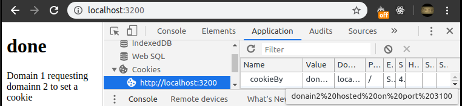

# nodejs way to set cookie as a third party
- run domain1 and domain2 nodejs file (index.js) (set on different port)
- to run open terminal for both domain1 and domain2
- run code 'npm update' on both the terminals
- run either 'nodemon index.js' (if installed) or 'node index.js' on both terminal
- open chrome and go to the address 'http://localhost:3200'
- open inspect (ctrl + shift + i) -> application -> storage -> cookies -> current site url
- a cookie will be present with name 'cookieBy' and value 'cookie-set-on-domain-1-on-port-3200'
- enjoy cross-site cookie ;)

### preview

# 
